<div align="center">

# 🌱 Pawlight（留光）

一个安静的地方，为离开的宠物留一颗可以反复回看的星球。

</div>

## 产品定位

Pawlight 不是宠物社区、相册工具、AI 复活服务，也不是殡葬或心理治疗产品。它只做一件事：**帮丧宠主人为TA创建一个私密、温柔的纪念空间**，把名字、照片、故事和信件慢慢留下来，也可以分享给同样记得TA的人，接收他们的"抱抱"。

- **主端**：iOS App（Swift + SwiftUI），主人在这里创建、维护纪念空间
- **访客端**：H5 分享页（Next.js），访客无需登录即可查看、送出抱抱
- **后端**：NestJS + PostgreSQL，图片存储 Cloudflare R2，内购走 App Store StoreKit 2

一次性付费解锁"完整纪念空间"（首发价 ¥29.9），免费档已经能跑通"创建 → 分享 → 抱抱 → 回访"的完整闭环，付费只增强容量和信箱，不阻断基础体验。

---

## 功能模块

### 1. 新手引导 · 创建TA的星球

三步走完创建：起名字 → 选主照片 → 选纪念空间方案。全程克制、不追问，"创建后你可以随时修改"。

<table>
<tr>
<td>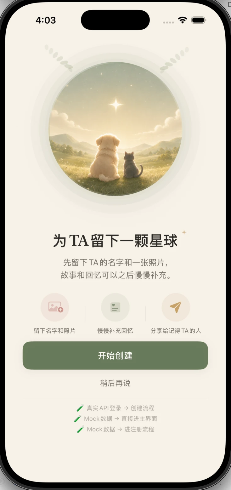<br><sub>开屏：为TA留下一颗星球</sub></td>
<td>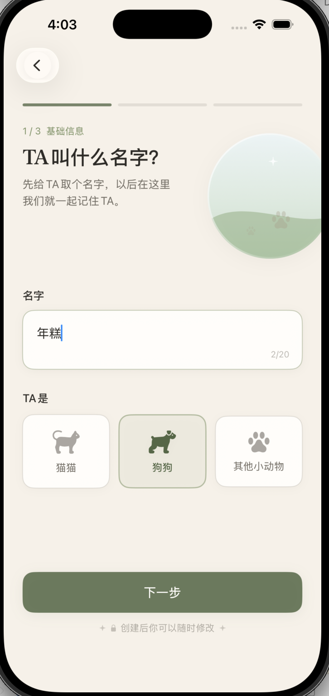<br><sub>第 1 步：取名字、选类型</sub></td>
<td>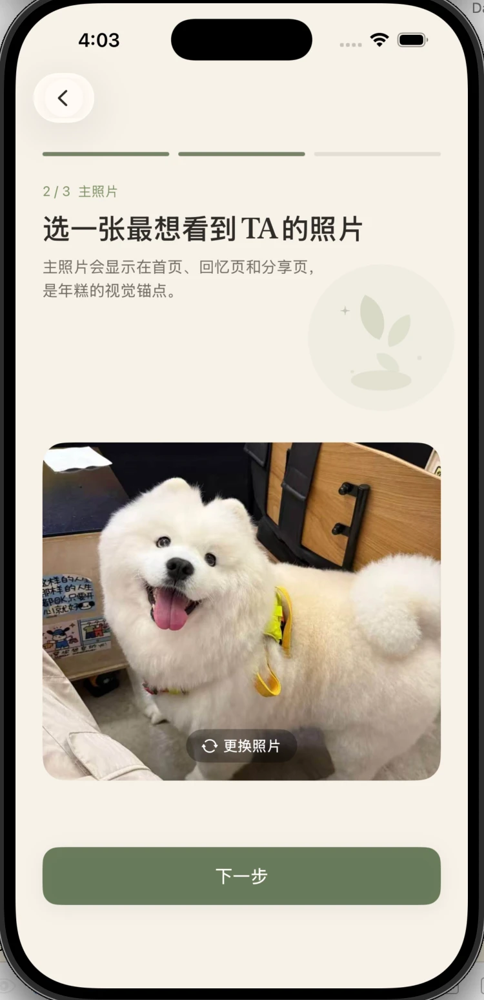<br><sub>第 2 步：选一张主照片</sub></td>
<td>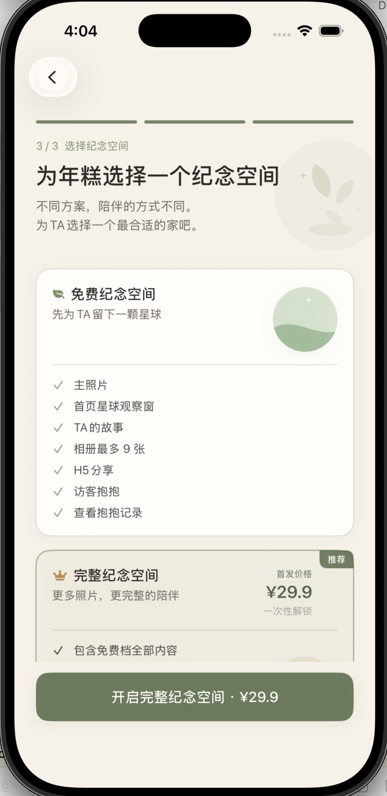<br><sub>第 3 步：选纪念空间方案</sub></td>
</tr>
</table>

免费纪念空间已包含主照片、首页星球观察窗、TA的故事、9 张相册、H5 分享、访客抱抱、抱抱记录——完整的基础闭环，不设付费墙。完整纪念空间在此之上把相册扩到 50 张，并解锁天堂信箱，一次性 ¥29.9 解锁，不做订阅。

### 2. 首页星球观察窗 · AI 场景画像

首页的核心是一颗圆形"星球观察窗"，主人打开 App 第一眼看到的就是TA。V2 在这个观察窗上叠加了一层新能力：主人用一句自然语言描述一个想看到TA所在的场景，系统据此生成TA的动漫风格画像，并进一步做成一段星球观察窗里的循环动态画面——让"回来看看TA"这件事本身变得更值得期待。

<table>
<tr>
<td>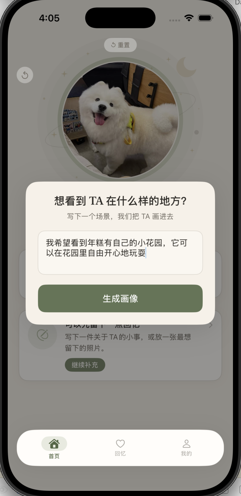<br><sub>描述一个想看到TA的场景</sub></td>
<td>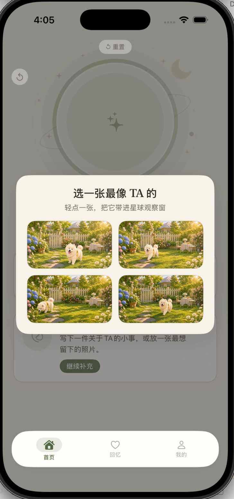<br><sub>从生成的画像里选一张最像TA的</sub></td>
</tr>
</table>

这个功能的设计前提是**身份保持优先于生成花哨程度**——花色、体型、五官特征必须让主人一眼认出"这就是TA"，所以流程上刻意保留了"多候选 + 主人挑选"这一步，而不是直接把结果塞给用户。

### 3. 回忆 · 纪念主页

主人日常补充内容的地方，把"TA的故事""照片回忆""天堂信箱""抱抱记录"收在同一个页面里，未创建内容时也有柔和的引导文案，不会让页面显得空。

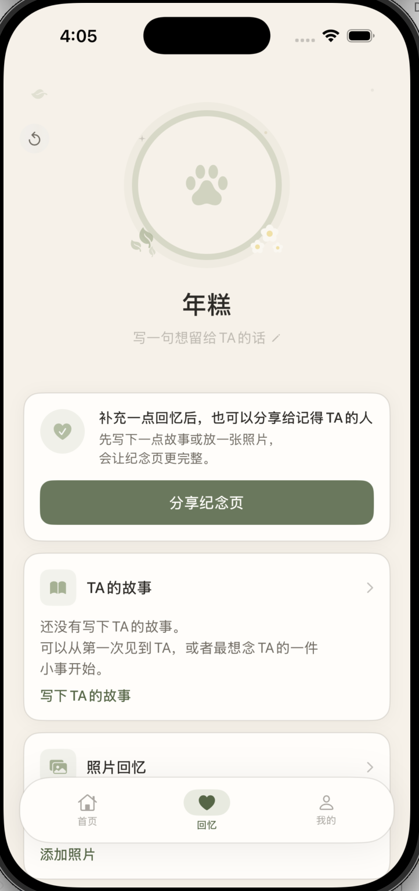<br><sub>回忆 Tab：纪念主页总览</sub>

### 4. TA的故事

一段自由书写的文字，配了四个话题引导（第一次见到TA / TA的小习惯 / 最想念的一件事 / TA陪伴我的一天），降低"不知道从哪写起"的门槛。这段故事会出现在纪念主页，分享出去后访客也能看到。

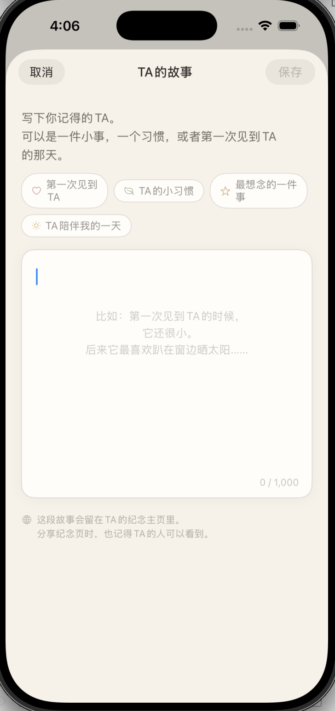<br><sub>写下TA的故事，最多 1000 字</sub>

### 5. 照片回忆

相册容量按纪念空间方案区分（免费 9 张 / 完整 50 张），空状态文案是"把和TA有关的瞬间慢慢放在这里"——不催促、不要求一次性传满。

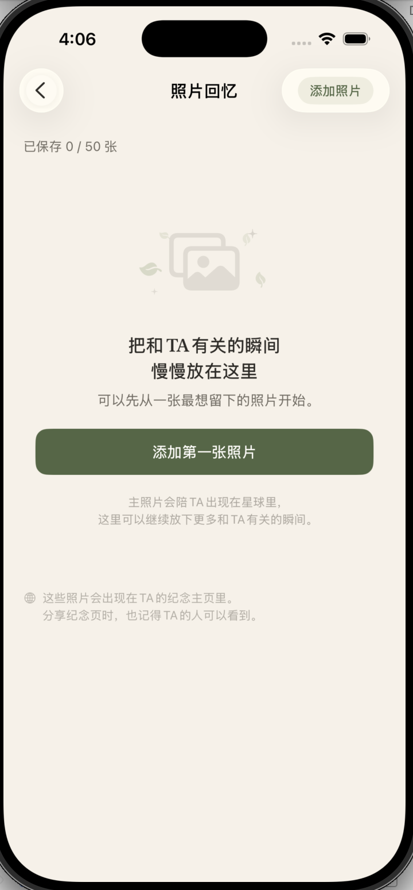<br><sub>照片回忆：已保存 0 / 50 张</sub>

### 6. 天堂信箱（付费权益）

一个只有主人自己能看到的私密写信空间，用来安放那些"不一定要放在纪念页里"的话。这是完整纪念空间的核心付费权益之一。

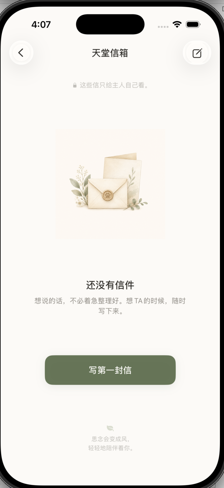<br><sub>天堂信箱：思念会变成风，轻轻地陪伴着你</sub>

### 7. 抱抱记录

主人分享纪念页给亲友后，访客可以在 H5 页面轻轻"抱抱"TA，这些抱抱会同步记录在这里，是主人和分享出去的人之间唯一的互动痕迹——不做评论、不做留言，只有这一个轻量、克制的动作。

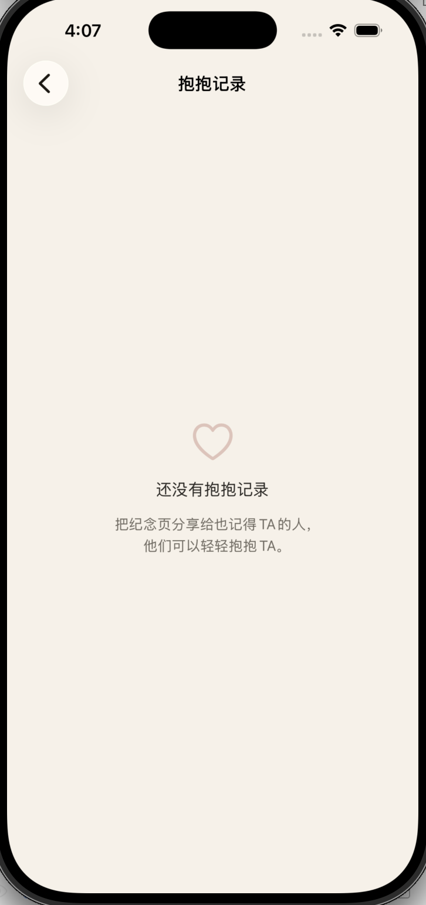<br><sub>抱抱记录：来自记得TA的人</sub>

### 8. H5 分享页（访客视角）

主人把纪念页分享出去后，访客打开的就是这个页面——不需要登录，也看不到天堂信箱这类私密内容（信件按设计只留给主人自己）。首屏是TA的照片、名字、在世区间和纪念语，配一个"轻轻抱抱TA"的按钮；往下滚是TA的故事和照片回忆，多于 6 张会折叠成"+N"；页面结尾引导访客把纪念页分享给更多记得TA的人。

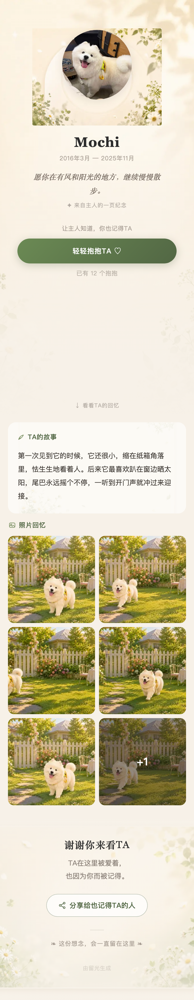<br><sub>H5 分享页：从首屏到故事、照片、结尾引导的完整滚动</sub>

---

## 技术栈

| 层 | 技术 |
| --- | --- |
| iOS App | Swift + SwiftUI，iOS 17+ |
| H5 访客页 | Next.js（App Router）+ Tailwind CSS，部署于 Vercel |
| 后端 | NestJS + Prisma，部署于 Railway |
| 数据库 | PostgreSQL |
| 图片存储 | Cloudflare R2 |
| 支付 | StoreKit 2 + 后端 App Store Server API 校验 |

```
.
├── ios/       # iOS App（Swift + SwiftUI）
├── backend/   # NestJS 后端
├── h5/        # 访客分享页（Next.js）
└── docs/      # 产品与技术文档
```
