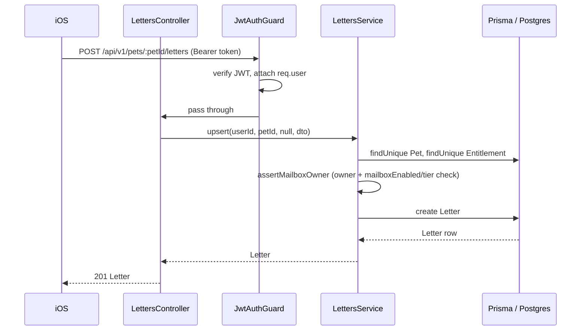
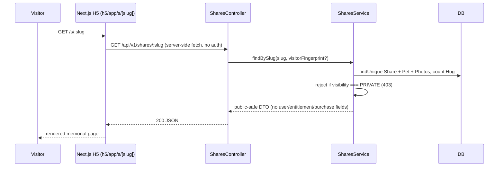
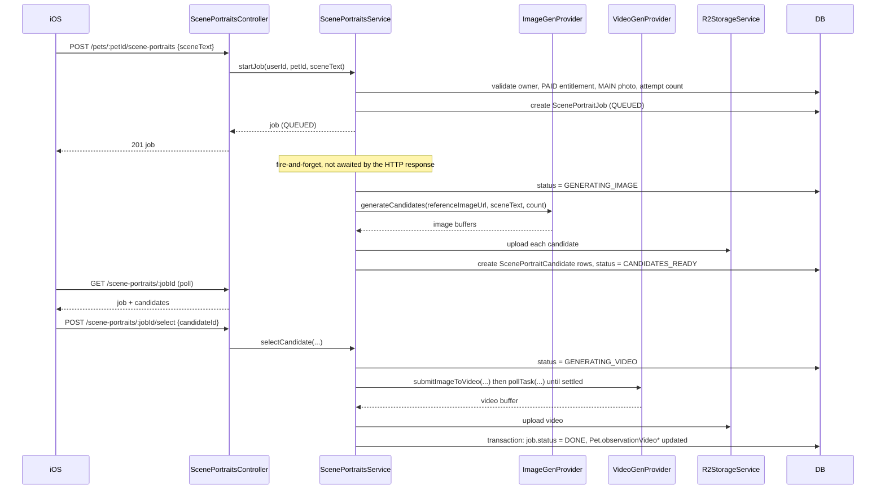

# Architecture

Technical reference. Describes what exists in the current codebase and how
the pieces call each other. Not a product description — see `AGENTS.md` §1
for fact priority if this ever disagrees with the code.

## Components

| Component | Path | Stack |
| --- | --- | --- |
| iOS app | `ios/MemorialApp` | Swift + SwiftUI, iOS 17+ target |
| H5 visitor page | `h5/` | Next.js (App Router) + Tailwind CSS |
| Backend API | `backend/` | NestJS 11 + Prisma 5 |
| Database | Postgres, accessed via Prisma | — |
| Object storage | Cloudflare R2 (S3-compatible) | via `@aws-sdk/client-s3` |
| Purchases | StoreKit 2 (client) + `@apple/app-store-server-library` (server-side JWS verification) | — |
| Auth | Sign in with Apple (`apple-signin-auth`) + a first-party JWT issued by the backend | — |
| AI image/video generation | `ImageGenProvider` / `VideoGenProvider` interfaces, see `docs/reference/ai-provider-integration.md` | — |

## Backend module map

`backend/src/`:

```
auth/         Sign in with Apple, debug-login, account deletion
pets/         Pet CRUD (one pet per account in the current PetsService)
photos/       Album/main photo upload, list, delete — owns nothing storage-specific (delegates to storage/)
shares/       Public share-link config per pet (slug, visibility, hug toggle) + public read endpoint
hugs/         Visitor "hug" reactions on a shared pet page (fingerprint-deduped)
letters/      CRUD for private memorial letters (mailbox), gated by entitlement
purchases/    Apple StoreKit 2 JWS verification -> flips Entitlement.tier to PAID
scene-portraits/  AI scene portrait job orchestration (see ai-provider-integration.md)
storage/      Shared Cloudflare R2 upload/delete (R2StorageService)
prisma/       PrismaService/PrismaModule (global DB client)
common/       JwtAuthGuard, CurrentUser decorator, entitlement.util.ts
config/       env.validation.ts (boot-time required-env assertions)
```

Each feature module follows the same shape: `*.module.ts` + `*.controller.ts`
+ `*.service.ts`, guarded by `JwtAuthGuard` where the endpoint is not public,
injecting `PrismaService` (global, no explicit import needed) and, where
relevant, `R2StorageService` (via `StorageModule`).

## Request flow: authenticated write (example — create a letter)



## Request flow: public H5 share page



## Request flow: AI scene portrait job



## Storage layout in R2

- Photos: `pets/{petId}/{16-hex-random}.{ext}`
- Scene-portrait candidates: `scene-portraits/{jobId}/candidate-{index}-{8-hex-random}.{ext}`
- Scene-portrait video: `scene-portraits/{jobId}/video-{8-hex-random}.{ext}`

`R2StorageService` (`backend/src/storage/r2-storage.service.ts`) is the only
code that constructs an S3 client; `photos/` and `scene-portraits/` both
inject it rather than each holding their own client.

## Account deletion fan-out

`AuthService.deleteAccount(userId)` (`backend/src/auth/auth.service.ts`) must
clean up R2 objects explicitly before the DB delete, because Postgres cascade
deletes only reach DB rows, not R2 objects:

1. `PhotosService.deleteAllForUser(userId)` — deletes every Photo's R2 object.
2. `ScenePortraitsService.deleteAllForUser(userId)` — deletes every
   ScenePortraitCandidate's and completed ScenePortraitJob's R2 object.
3. `prisma.user.delete(...)` — cascades to Pet, Photo, Share, Hug, Letter,
   ScenePortraitJob, ScenePortraitCandidate, Entitlement rows.

## iOS module map

`ios/MemorialApp/Sources/`:

```
App/            AppState (app-wide ObservableObject), MemorialApp (entry point), Info.plist
Common/Network/ APIClient (URLSession-based singleton), APIModels (Decodable DTOs)
Common/Models/  Domain models (Pet, Photo, Entitlement, Share, Hug, Letter, ...)
Common/Utils/   Strings (bilingual copy), AppColors, AppFonts
Features/       One folder per feature area (Home, Onboarding, Memory, Album,
                Mailbox, Hugs, Share, Entitlement, Mine, ScenePortrait)
```

`AppState` holds the single source of truth for the logged-in user's pet,
entitlement, photos, story, letters, hugs, and share config, refreshed from
`GET /api/v1/pets/mine` via `loadCurrentPet()`. `ScenePortraitController` is a
separate `ObservableObject` (also environment-injected) that owns only the
generation-flow UI state; it does not hold a reference to `AppState` and
communicates completion via a callback so the caller decides when to refresh
`AppState`.
