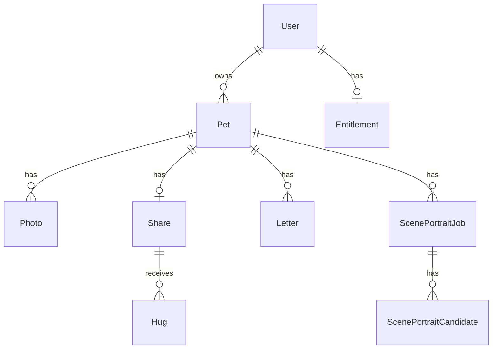

# Data Model

Source of truth: `backend/prisma/schema.prisma`. This document restates it in
prose; if the two disagree, the schema file wins (see `AGENTS.md` §1).

## Entity relationship overview



## `User`

| Field | Type | Notes |
| --- | --- | --- |
| `id` | `String` (cuid) | PK |
| `appleUserId` | `String` | `@unique` — Sign in with Apple subject |
| `email` | `String?` | from Apple, optional |
| `nickname` | `String?` | |
| `avatarUrl` | `String?` | |
| `createdAt` / `updatedAt` | `DateTime` | |

Relations: `pets Pet[]`, `entitlement Entitlement?` (0 or 1).

## `Pet`

| Field | Type | Notes |
| --- | --- | --- |
| `id` | `String` (cuid) | PK |
| `userId` | `String` | FK -> `User.id`, `onDelete: Cascade` |
| `name` | `String` | |
| `type` | `PetType` | enum `CAT \| DOG \| OTHER`, default `CAT` |
| `arrivedOn`, `bornOn`, `leftOn` | `String?` | free-form date strings, not `DateTime` |
| `mainPhotoId` | `String?` | plain pointer, **no** `@relation` to `Photo` |
| `story` | `String?` | |
| `memorialSentence` | `String?` | |
| `observationVideoJobId` | `String?` | plain pointer to the `ScenePortraitJob` that produced the active video; **no** `@relation` |
| `observationVideoKey` | `String?` | R2 object key of the active observation-window video |
| `observationVideoUrl` | `String?` | R2 public URL; `null` means the observation window shows the static main photo instead |
| `createdAt` / `updatedAt` | `DateTime` | |

Relations: `photos Photo[]`, `share Share?` (0 or 1), `letters Letter[]`,
`scenePortraitJobs ScenePortraitJob[]`.

No unique/cascade constraint limits a `User` to one `Pet` at the database
level — the one-pet-per-account rule is enforced in application code
(`PetsService.create`, see `docs/reference/api-reference.md`), not the schema.

## `Entitlement`

Account-level, **not** per-pet — one row per `User` (`userId @unique`).

| Field | Type | Notes |
| --- | --- | --- |
| `id` | `String` (cuid) | PK |
| `userId` | `String` | FK -> `User.id`, `@unique`, `onDelete: Cascade` |
| `tier` | `Tier` | enum `FREE \| PAID`, default `FREE` |
| `photoLimit` | `Int` | default `9` |
| `mailboxEnabled` | `Boolean` | default `false` |
| `createdAt` / `updatedAt` | `DateTime` | |

`backend/src/common/entitlement.util.ts` derives the effective album photo
limit: an explicit positive `photoLimit` wins; otherwise `PAID` -> 50,
`FREE` -> 9.

## `Photo`

| Field | Type | Notes |
| --- | --- | --- |
| `id` | `String` (cuid) | PK |
| `petId` | `String` | FK -> `Pet.id`, `onDelete: Cascade` |
| `type` | `PhotoType` | enum `MAIN \| ALBUM`, default `ALBUM` |
| `r2Key` / `r2Url` | `String` | R2 object key + derived public URL |
| `caption` | `String?` | |
| `sortOrder` | `Int` | default `0` |
| `createdAt` | `DateTime` | |

Index: `@@index([petId, type])`. No `@@unique` on `(petId, type=MAIN)` — a pet
having more than one `MAIN` photo is not blocked by the schema; the app
resolves the "current" main photo via `Pet.mainPhotoId` first, falling back
to any `Photo` with `type: MAIN`.

## `ScenePortraitJobStatus` (enum)

```
QUEUED -> GENERATING_IMAGE -> CANDIDATES_READY -> GENERATING_VIDEO -> DONE
                                                                    -> FAILED (from any in-flight state)
```

Full transition detail: `docs/reference/state-machines.md`.

## `ScenePortraitJob`

One "describe a scene -> pick a candidate -> get a looping video" attempt.

| Field | Type | Notes |
| --- | --- | --- |
| `id` | `String` (cuid) | PK |
| `petId` | `String` | FK -> `Pet.id`, `onDelete: Cascade` |
| `sceneText` | `String` | user's scene description |
| `status` | `ScenePortraitJobStatus` | default `QUEUED` |
| `selectedCandidateId` | `String?` | set once a candidate is picked; not an FK constraint, just a stored id |
| `videoR2Key` / `videoR2Url` | `String?` | set once the video upload succeeds |
| `errorCode` / `errorMessage` | `String?` | set only when `status = FAILED` |
| `createdAt` / `updatedAt` | `DateTime` | |

Relations: `candidates ScenePortraitCandidate[]`.
Index: `@@index([petId, createdAt])` (used to count attempts per pet).

## `ScenePortraitCandidate`

| Field | Type | Notes |
| --- | --- | --- |
| `id` | `String` (cuid) | PK |
| `jobId` | `String` | FK -> `ScenePortraitJob.id`, `onDelete: Cascade` |
| `r2Key` / `r2Url` | `String` | |
| `sortOrder` | `Int` | default `0` — candidate display order |
| `createdAt` | `DateTime` | |

Index: `@@index([jobId])`.

## `Share`

One per `Pet` (`petId @unique`).

| Field | Type | Notes |
| --- | --- | --- |
| `id` | `String` (cuid) | PK |
| `petId` | `String` | FK -> `Pet.id`, `@unique`, `onDelete: Cascade` |
| `slug` | `String` | `@unique`, public share-page identifier |
| `visibility` | `Visibility` | enum `LINK \| PRIVATE`, default `LINK` |
| `hugEnabled` | `Boolean` | default `true` |
| `createdAt` / `updatedAt` | `DateTime` | |

Relations: `hugs Hug[]`.

## `Hug`

| Field | Type | Notes |
| --- | --- | --- |
| `id` | `String` (cuid) | PK |
| `shareId` | `String` | FK -> `Share.id`, `onDelete: Cascade` |
| `visitorFingerprint` | `String` | client-generated id (H5 localStorage) |
| `visitorName` / `message` | `String?` | |
| `createdAt` | `DateTime` | |

Constraint: `@@unique([shareId, visitorFingerprint])` — this is what makes a
duplicate hug from the same visitor a database-level conflict
(`Prisma P2002`), independent of the service-layer pre-check. Index:
`@@index([shareId])`.

## `Letter`

| Field | Type | Notes |
| --- | --- | --- |
| `id` | `String` (cuid) | PK |
| `petId` | `String` | FK -> `Pet.id`, `onDelete: Cascade` |
| `title` | `String?` | |
| `content` | `String` | required |
| `createdAt` / `updatedAt` | `DateTime` | |

No `userId` column — ownership is derived by joining through `pet.userId`
(see `LettersService.assertMailboxOwner` / `PhotosService.remove`, which use
the same pattern for `Photo`).

## Fields with business-logic significance

- `Pet.mainPhotoId` and `Pet.observationVideoJobId/Key/Url` are **not**
  foreign keys — they are plain string pointers, resolved manually in
  application code. Deleting the referenced `Photo`/`ScenePortraitJob` row
  does not automatically clear these fields.
- `Entitlement.mailboxEnabled` and `Entitlement.tier` are checked
  independently in different places (`LettersService` checks
  `mailboxEnabled === true || tier === 'PAID'`; `ScenePortraitsService`
  checks `tier === 'PAID'` only) — they are not always equivalent gates.
- `Hug.visitorFingerprint` uniqueness is scoped to `shareId`, not global — the
  same fingerprint can hug different pets' share pages.
