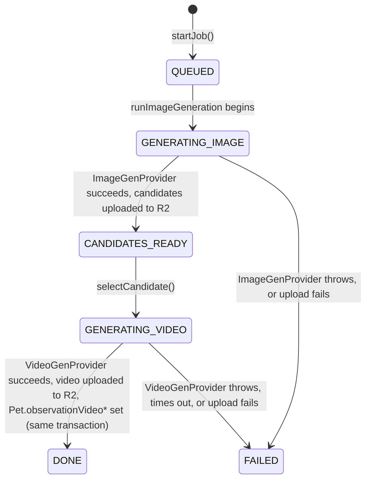
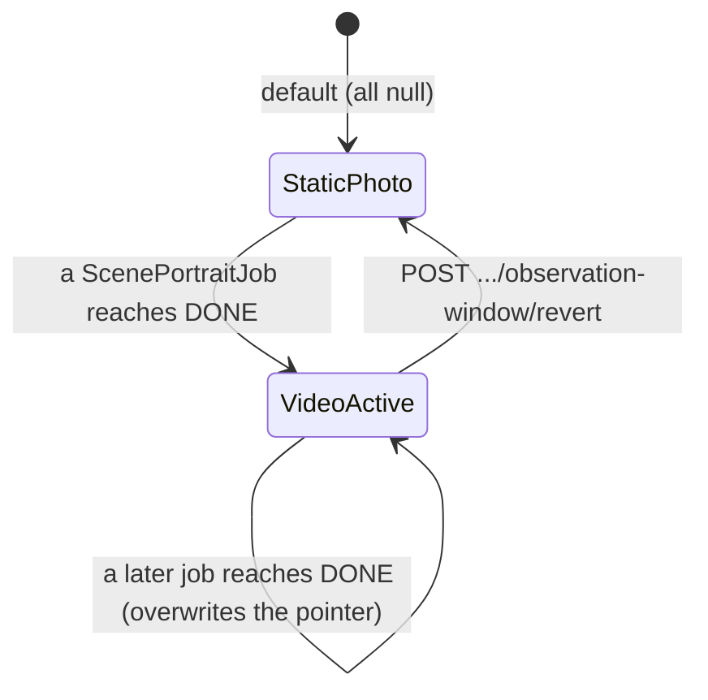
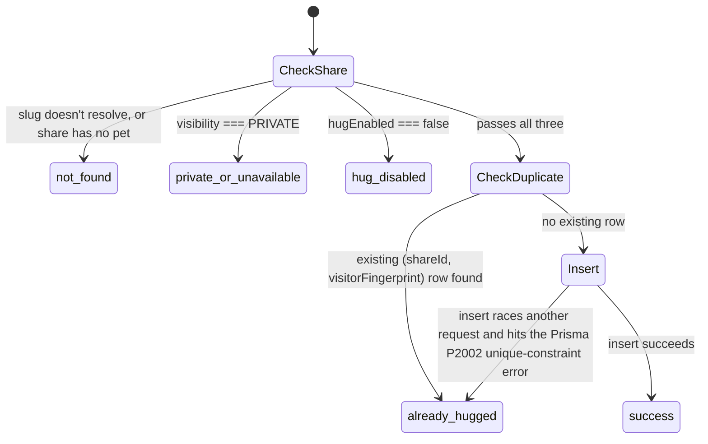
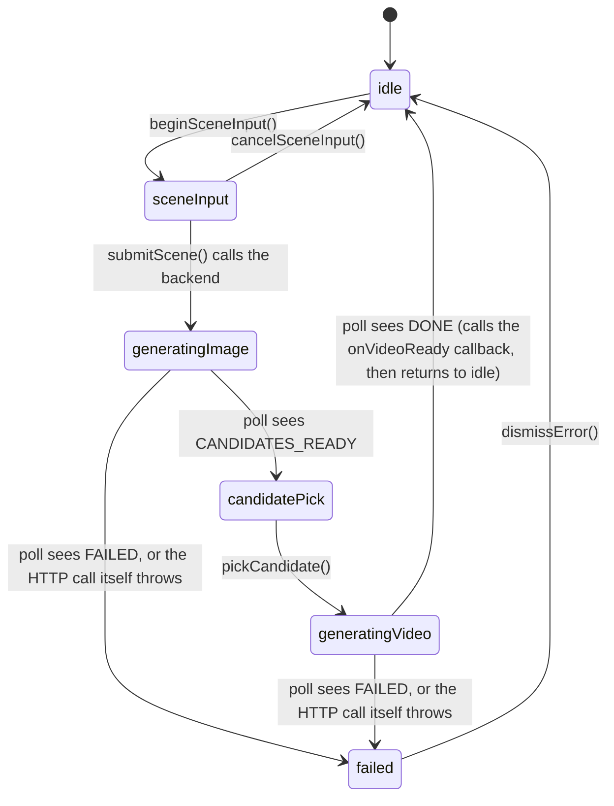

# State Machines

Technical reference of the state machines that actually exist in the current
code. Split explicitly into **persistent backend state** (a column in
Postgres) and **client UI state** (exists only in memory on a device, never
written to the database) — the two are easy to conflate and have different
failure modes (a backend state survives app restarts and multiple devices; a
UI state does not).

## Persistent backend state

### `ScenePortraitJob.status` (`ScenePortraitJobStatus` enum)

Implementation: `backend/src/scene-portraits/scene-portraits.service.ts`
(`runImageGeneration`, `selectCandidate`, `runVideoGeneration`).

Notes:
- `FAILED` is terminal — there is no retry-in-place; the user starts a new
  job (subject to the attempt cap).
- `errorCode`/`errorMessage` are only meaningful when `status === FAILED`.
  Known `errorCode` values: `PROVIDER_NOT_CONFIGURED` (provider threw
  `ScenePortraitProviderNotConfiguredError`, i.e. missing API key),
  `GENERATION_FAILED` (any other thrown error).
  `GENERATION_FAILED` (any other thrown error).
- Transitions run in an in-process, fire-and-forget async function started
  right after the QUEUED row is created — not a queue/worker. If the backend
  process restarts mid-flight, the job is left stuck in `GENERATING_IMAGE`
  or `GENERATING_VIDEO` with no automatic recovery.
- Attempt cap: `startJob` counts existing jobs for the pet where
  `status != FAILED`; at 3 it rejects new jobs with
  `SCENE_PORTRAIT_ATTEMPTS_EXHAUSTED`. A `FAILED` job does not consume a slot.

### `Pet.observationVideo*` (derived, not its own enum)

Not a separate state machine — three nullable columns
(`observationVideoJobId`, `observationVideoKey`, `observationVideoUrl`) that
are either all null or all set together.

`revert` only clears these three columns — it does not delete the
`ScenePortraitJob`/`ScenePortraitCandidate` rows or their R2 objects, so the
video is not recoverable through the API after a revert (the R2 object still
exists but nothing points at it) but the job history remains queryable.

### `Share.visibility` (`Visibility` enum)

Two values, `LINK` (default) and `PRIVATE`. Not a sequential state machine —
the owner can flip between them freely via `PATCH /api/v1/pets/:petId/share`.
Effect: `SharesService.findBySlug` (the public endpoint) throws `403` when
`visibility === 'PRIVATE'`; `LINK` allows anonymous reads.

### `Share.hugEnabled` (boolean)

Independent of `visibility`. When `false`, `HugsService.create` returns
`{ status: 'hug_disabled' }` for that share even if `visibility === 'LINK'`
(the page itself stays viewable; only the hug action is blocked).

### `Hug` creation outcome (not a stored field — a per-request result)

`HugsService.create` always returns one of these `status` values instead of
throwing for expected business outcomes:

### `Entitlement.tier` (`Tier` enum)

`FREE` (default, created on first login) or `PAID`. One-way in the current
code: `PurchasesService.verifyAndApply` upserts to `PAID` on a verified
non-revoked purchase of `com.pawlight.full_memorial_space`; nothing in the
codebase transitions a `PAID` entitlement back to `FREE` (no refund-webhook
handler exists).

## Client-only UI state (iOS)

### `ScenePortraitController.Stage` (Swift enum, `ios/MemorialApp/Sources/Features/ScenePortrait/ScenePortraitController.swift`)

This exists **only in the iOS process's memory** — it is not a database
column and is not synchronized across devices or app restarts.

Notes:
- This client state is a **view** over the backend's `ScenePortraitJob`
  state via polling (`fetchScenePortraitJob`, ~2s interval) — the backend
  enum above is the actual source of truth.
- There is no persistence or resume-on-relaunch: if the app is killed while
  in `generatingImage`/`generatingVideo`, the next launch starts at `idle`
  regardless of what the backend job is doing. The eventual result still
  reaches the UI on next login/launch because `AppState.loadCurrentPet()`
  re-fetches `Pet.observationVideoUrl` from the server independently of this
  controller.
- `HomeView`'s observation-window branch additionally reads
  `appState.currentPet?.observationVideoUrl` directly (backend state, via
  `AppState`) to decide whether to keep showing a video after this
  controller has already returned to `idle`.
